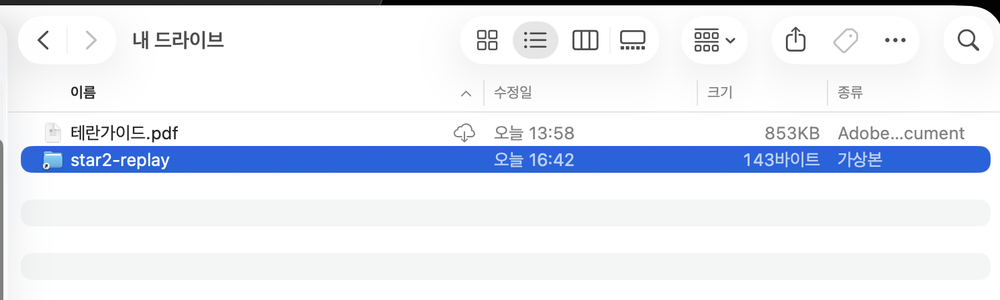

# 사용자 참여 방법

**핵심만 먼저:**
1. **주인장에게 공유 Google Drive 링크를 받습니다.**
2. **공유받은 폴더를 `내 드라이브`에 `바로가기 추가`합니다.**
3. **내 컴퓨터에 Google Drive를 설치하고 로그인합니다.**
4. **스타2 리플레이가 공유 Drive 안 내 폴더로 들어가게 설정합니다.**
5. **Slack 채널 초대를 받아, 주인장 컴퓨터가 보내는 분석 메시지를 확인합니다.**

이 시스템은 **주인장 컴퓨터가 공유 Drive 폴더를 감시**하고, 새 `.SC2Replay` 파일이 올라오면 자동 분석 후 **Slack 채널로 결과를 보내는 방식**입니다.

---

## 1) 주인장에게 공유 Drive URL을 받습니다
먼저 주인장에게 **공유 Google Drive 폴더 링크**를 받으세요.

예시:
- `https://drive.google.com/drive/folders/...`

이 링크는 여러분이 리플레이를 업로드할 **공용 제출 폴더**입니다.

### 아주 중요: 공유받은 뒤 바로가기를 내 드라이브에 추가하세요
공유 링크만 받은 상태에서는, 웹에서는 보여도 **로컬 Google Drive 경로에 폴더가 바로 안 보일 수 있습니다.**

따라서 공유 폴더를 연 다음 반드시:
- 우클릭 또는 상단 메뉴에서 **`바로가기 추가`**를 누르고
- 위치를 **`내 드라이브`**로 선택해서
- **`star2-replay` 바로가기를 내 드라이브에 추가**하세요.

이 단계를 해야:
- 웹 Drive뿐 아니라
- **탐색기(Finder/파일 탐색기)에서도 `내 드라이브 > star2-replay`가 보여야 하고**
- **로컬 Google Drive 폴더 경로에서도 공유 폴더가 보여서**
- 스타2 리플레이를 그 경로로 넣거나 연결하기 쉬워집니다.

### 최종 확인 기준
설정이 끝난 뒤에는 반드시 아래 상태가 보여야 합니다.
- Google Drive 웹에서: `내 드라이브` 아래에 `star2-replay` 바로가기 표시
- macOS Finder 또는 Windows 파일 탐색기에서: **`Google Drive > 내 드라이브 > star2-replay`가 실제로 보임**

아래처럼 Finder/파일 탐색기에서 **`내 드라이브` 안에 `star2-replay`가 보여야 정상**입니다.



이미지 기준으로 확인할 포인트:
- 상단 위치가 **`내 드라이브`** 여야 합니다.
- 목록에 **`star2-replay`** 가 보여야 합니다.
- 종류가 가상본/바로가기처럼 보이더라도, **탐색기에서 이 항목이 실제로 보여야 다음 단계 진행이 쉽습니다.**
- 이 상태가 되어야 로컬 Google Drive 경로에서 `star2-replay` 안으로 들어가 리플레이를 넣거나 연결할 수 있습니다.

즉, 사용자 입장에서는
**공유 링크 수락 → 내 드라이브에 바로가기 추가 → Finder/파일 탐색기에서 `star2-replay` 확인**까지가 한 세트입니다.

---

## 2) 내 컴퓨터에 Google Drive를 설치합니다
본인 컴퓨터에 **Google Drive 데스크톱 앱**을 설치하세요.

설치 링크:
- https://www.google.com/drive/download/

설치 후 해야 할 일:
- 본인 Google 계정으로 로그인
- 주인장이 공유한 폴더가 Drive에서 보이는지 확인

---

## 3) 스타2 리플레이가 공유 Drive 안 내 폴더로 자동 들어가게 연결합니다
가장 중요한 단계입니다.

목표는 **게임이 끝날 때 생성되는 `.SC2Replay` 파일이 자동으로 공유 Drive 안 내 폴더에 생기게 하는 것**입니다.

### 권장 구조
- 공유 Drive 안에 **본인 이름 폴더**를 하나 만듭니다.
  - 예: `star2-replay/kihoon/`
- 최종적으로 스타2가 저장하는 `Multiplayer` 폴더가 **그 Google Drive 폴더를 바라보게** 만들면 가장 편합니다.

즉, 매 게임 후 수동 복사를 하지 말고:
- 스타2는 평소처럼 `Multiplayer`에 리플레이를 저장하고
- 그 `Multiplayer`가 실제로는 `Google Drive > 내 드라이브 > star2-replay > 내이름폴더`를 가리키게 구성하는 방식입니다.

### Windows에서 가장 쉬운 방법: 폴더 이름 바꾸기 + `mklink /J`
Windows 사용자는 보통 아래 순서로 연결하는 것이 가장 단순합니다.

1. 기존 리플레이 폴더 위치를 찾습니다.
   - 예:
     - `C:\Users\osori\Documents\StarCraft II\Accounts\1041828842-S2-1-1987820\Replays\Multiplayer`
2. 기존 `Multiplayer` 폴더 이름을 바꾸거나 다른 곳으로 옮깁니다.
   - 예: `Multiplayer_backup`
3. Google Drive 쪽에 본인 폴더가 있는지 확인합니다.
   - 예:
     - `G:\내 드라이브\star2-replay\kihoon`
4. **관리자 권한으로 연 명령 프롬프트**에서 아래처럼 실행합니다.

```bat
mklink /J "C:\Users\osori\Documents\StarCraft II\Accounts\1041828842-S2-1-1987820\Replays\Multiplayer" "G:\내 드라이브\star2-replay\kihoon"
```

이 명령은:
- 스타2 입장에서는 여전히 `Multiplayer` 폴더에 저장하는 것처럼 보이지만
- 실제 파일은 `Google Drive > 내 드라이브 > star2-replay > kihoon` 안에 저장되게 만듭니다.

### 연결이 잘 됐는지 확인하는 방법
아래 3가지가 모두 맞으면 정상입니다.
- 스타2 리플레이 경로에 `Multiplayer`가 다시 보입니다.
- `dir` 또는 탐색기에서 보면 이 폴더가 **정션/바로가기처럼 연결된 폴더**입니다.
- 게임 한 판 후 `.SC2Replay` 파일이 `Google Drive > 내 드라이브 > star2-replay > 내이름폴더` 쪽에 실제로 생깁니다.

### 결과적으로 이렇게 되어야 합니다
예:
- `Google Drive/내 드라이브/star2-replay/kihoon/game1.SC2Replay`
- `Google Drive/내 드라이브/star2-replay/kihoon/game2.SC2Replay`

즉, **공유 Drive 안의 본인 폴더에 `.SC2Replay` 파일이 자동으로 생기면 성공**입니다.

### 참고
- `mklink /J`는 **관리자 권한** 명령 프롬프트에서 실행해야 합니다.
- 계정마다 `Accounts/...` 경로 숫자가 다를 수 있으니, 본인 PC의 실제 스타2 리플레이 경로를 기준으로 바꿔 넣으세요.
- Google Drive 드라이브 문자가 `G:`가 아닐 수도 있습니다. 탐색기에서 실제 드라이브 문자를 먼저 확인하세요.
- 이미 `Multiplayer` 폴더가 남아 있으면 `mklink`가 실패할 수 있으니, 먼저 이름 변경 또는 이동이 필요합니다.

---

## 4) Slack 채널 초대를 받아 분석 메시지를 확인합니다
분석은 **주인장 컴퓨터에서 실행되는 봇**이 처리합니다.

따라서:
- 주인장에게 **Slack 채널 초대**를 받으세요.
- 채널에 들어오면, 내가 올린 리플레이 분석 결과가 자동으로 올라옵니다.

동작 흐름은 아래와 같습니다:
1. 내가 게임을 플레이합니다.
2. 리플레이가 공유 Drive 안 내 폴더로 올라갑니다.
3. 주인장 컴퓨터가 새 리플레이를 감지합니다.
4. 자동 분석이 실행됩니다.
5. Slack 채널에 결과가 전송됩니다.

---

## 한 줄 요약
- **공유 Drive 링크 받기 → Google Drive 설치 → 리플레이를 공유폴더 안 내 폴더로 저장 → Slack에서 분석 결과 받기**

---

## 사용자용 짧은 안내문
1. 주인장에게 **공유 Google Drive 링크**를 받습니다.
2. **Google Drive 데스크톱 앱**을 설치하고 로그인합니다.
3. 공유 폴더 안에 **본인 이름 폴더**를 만들고, 스타2 리플레이가 그 폴더로 들어가게 설정합니다.
4. **Slack 채널 초대**를 받아 들어오면, 업로드된 리플레이 분석 결과를 자동으로 확인할 수 있습니다.
